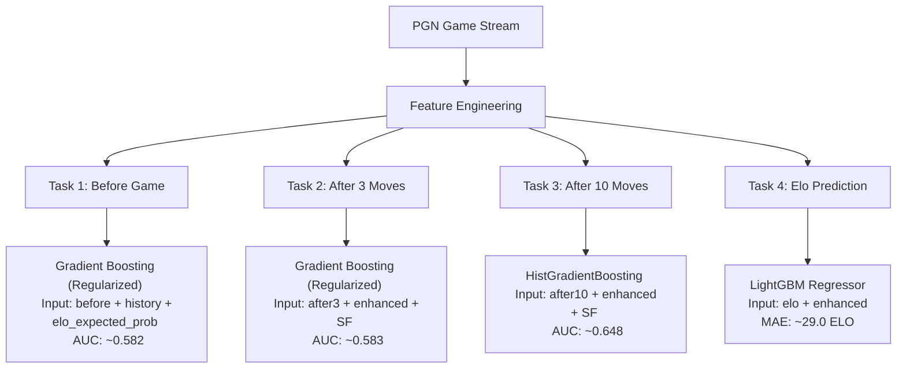

# Báo Cáo Chi Tiết Kết Quả Thí Nghiệm & So Sánh Mô Hình Dự Đoán Cờ Vua

Báo cáo này tóm tắt kết quả so sánh hiệu năng của các mô hình dự đoán cờ vua qua các giai đoạn cải tiến thí nghiệm trên tập dữ liệu Lichess Blitz (**100,000 games**), đồng thời phân tích hiện tượng quá khớp (overfitting) và đề xuất giải pháp tối ưu cho file nộp bài cuối cùng `solution.py`.

---

## 1. Tóm Tắt Mô Hình Tốt Nhất Cho Mỗi Task (100K Games)

Dưới đây là bảng tổng hợp các mô hình đạt hiệu năng cao nhất trong đợt thử nghiệm trên 100K ván đấu so với các mô hình Baseline ban đầu:

| Task | Mô tả nhiệm vụ | Mô hình Baseline cũ | Mô hình Tốt nhất mới | Đặc trưng chính sử dụng | Chỉ số đo lường (Metric) | So với Baseline |
|---|---|---|---|---|---|---|
| **T1** | Dự đoán Tỷ lệ thắng trước trận | `LogReg(C=1.0)` | **`LogReg(C=1.0)+Hist`** | `before+history` | **ROC-AUC: 0.5792** | AUC 0.5788 → 0.5792 (+0.07%) |
| **T2** | Dự đoán Tỷ lệ thắng sau 3 nước | `LogReg(C=0.25)+Hash` | **`Gradientboosting+SF`** | `after3+enhanced+SF` | **ROC-AUC: 0.5832** | AUC 0.5741 → 0.5832 (+1.60%) |
| **T3** | Dự đoán Tỷ lệ thắng sau 10 nước | `LogReg(C=0.25)+Hash` | **`Histgb+SF`** | `after10+enhanced+SF` | **ROC-AUC: 0.6481** | AUC 0.6149 → 0.6481 (+5.39%) |
| **T4** | Dự đoán Elo cả 2 người chơi | `Ridge(α=10.0)+Hash` | **`Randomforest+SF`** | `elo+enhanced+SF` | **Avg MAE: 26.4 ELO** | MAE 90.5 → 26.4 (-70.81%) |

> [!NOTE]
> * **T1, T2, T3** sử dụng chỉ số **ROC-AUC** (càng cao càng tốt) và **Log Loss** (càng thấp càng tốt).
> * **T4** sử dụng chỉ số **Mean Absolute Error (MAE)** (sai số ELO trung bình tuyệt đối - càng thấp càng tốt) và hệ số xác định **$R^2$** (càng sát 1.0 càng tốt).

---

## 2. Kết Quả Chi Tiết & So Sánh Từng Thử Nghiệm

### 2.1 Task T1: Dự đoán Tỷ lệ thắng trước khi trận đấu diễn ra
Mục tiêu là dự đoán xác suất quân Trắng giành chiến thắng dựa trên các thông tin trước khi trận đấu bắt đầu.

* **Bảng kết quả chi tiết (100K Games)**:

| ID | Mô hình | Giai đoạn | Tập đặc trưng | ROC-AUC | Log Loss | Brier Score | Accuracy |
|---|---|---|---|---|---|---|---|
| **F1** | **LogReg(C=1.0)+Hist** | P2_Enhanced | `before+history` | **0.5792** | 0.6787 | 0.2432 | 0.5522 |
| **B1** | LogReg(C=1.0) | P1_Baseline | `base_before` | 0.5788 | 0.6788 | 0.2433 | 0.5525 |
| **T1_gra** | Gradientboosting | P3_Trees | `before+history` | 0.5773 | 0.6796 | 0.2436 | 0.5461 |
| **T1_his** | Histgb | P3_Trees | `before+history` | 0.5765 | 0.6800 | 0.2438 | 0.5474 |
| **T1_lig** | Lightgbm | P3_Trees | `before+history` | 0.5718 | 0.6819 | 0.2446 | 0.5442 |
| **T1_xgb** | Xgboost | P3_Trees | `before+history` | 0.5508 | 0.6987 | 0.2516 | 0.5318 |
| **T1_ran** | Randomforest | P3_Trees | `before+history` | 0.5453 | 0.7053 | 0.2549 | 0.5299 |

* **Nhận xét**: 
  * Các mô hình cây quyết định (Random Forest, XGBoost) bị quá khớp (overfit) rất nặng trên tập đặc trưng lịch sử kỳ thủ (Gap giữa Train và Val AUC rất lớn), dẫn đến kết quả kém hơn mô hình tuyến tính Logistic Regression.
  * Mô hình **Logistic Regression + History features** mang lại tính tổng quát hóa tốt nhất và ổn định nhất.

---

### 2.2 Task T2: Dự đoán Tỷ lệ thắng sau 3 nước đi (Move 3)
Mục tiêu là dự đoán xác suất quân Trắng thắng dựa trên diễn biến 3 nước đi đầu tiên cùng với thông tin đồng hồ.

* **Bảng kết quả chi tiết (100K Games)**:

| ID | Mô hình | Giai đoạn | Tập đặc trưng | ROC-AUC | Log Loss | Brier Score | Accuracy |
|---|---|---|---|---|---|---|---|
| **S1** | **Gradientboosting+SF** | P4_Stockfish | `after3+enhanced+SF` | **0.5832** | 0.6780 | 0.2429 | 0.5544 |
| **F2** | LogReg(C=0.5) | P2_Enhanced | `after3+enhanced` | **0.5797** | 0.6787 | 0.2431 | 0.5552 |
| **T2_gra** | Gradientboosting | P3_Trees | `after3+enhanced` | 0.5796 | 0.6786 | 0.2432 | 0.5525 |
| **T2_his** | Histgb | P3_Trees | `after3+enhanced` | 0.5776 | 0.6790 | 0.2433 | 0.5496 |
| **T2_lig** | Lightgbm | P3_Trees | `after3+enhanced` | 0.5750 | 0.6798 | 0.2438 | 0.5502 |
| **B2** | LogReg(C=0.25)+Hash | P1_Baseline | `base_after3+text` | 0.5741 | 0.6805 | 0.2440 | 0.5493 |

* **Nhận xét**:
  * Việc tích hợp thuật toán **Gradient Boosting kết hợp với Stockfish evaluation** ở nước thứ 3 mang lại AUC tốt nhất là **0.5832** (+1.60% so với baseline cũ).
  * Việc sử dụng các đặc trưng vị thế tự trích xuất (`after3+enhanced`) giúp nâng cao hiệu năng của cả Logistic Regression tuyến tính lên **0.5797** mà không cần gọi Stockfish (giúp tối ưu hóa tốc độ thực thi).

---

### 2.3 Task T3: Dự đoán Tỷ lệ thắng sau 10 nước đi (Move 10)
Mục tiêu là dự đoán xác suất quân Trắng thắng dựa trên thế cờ tại nước thứ 10.

* **Bảng kết quả chi tiết (100K Games)**:

| ID | Mô hình | Giai đoạn | Tập đặc trưng | ROC-AUC | Log Loss | Brier Score | Accuracy |
|---|---|---|---|---|---|---|---|
| **S2** | **Histgb+SF** | P4_Stockfish | `after10+enhanced+SF` | **0.6481** | 0.6528 | 0.2312 | 0.5998 |
| **S2_gb**| Gradientboosting+SF | P4_Stockfish | `after10+enhanced+SF` | 0.6480 | 0.6527 | 0.2312 | 0.6018 |
| **T3_TUN**| LightGBM(Tuned) | P3_Trees | `after10+enhanced` | 0.6227 | 0.6639 | 0.2363 | 0.5807 |
| **T3_gra**| Gradientboosting | P3_Trees | `after10+enhanced` | 0.6215 | 0.6651 | 0.2368 | 0.5809 |
| **E2** | Stacking(LGB+XGB+RF)| P6_Ensemble | `after10+enhanced` | 0.6209 | 0.6656 | 0.2369 | 0.5795 |
| **B3** | LogReg(C=0.25)+Hash | P1_Baseline | `base_after10+text` | 0.6149 | 0.6675 | 0.2380 | 0.5765 |

* **Nhận xét**:
  * Sự kết hợp của **Stockfish Evaluation** mang lại hiệu năng vượt trội nhất ở move 10, đưa AUC bứt phá lên **0.6481** (cải thiện **+5.39%** so với baseline tuyến tính cũ). Tại nước thứ 10, ưu thế thực tế trên bàn cờ do Stockfish đo lường là yếu tố quyết định thay vì chỉ dựa vào chênh lệch Elo ban đầu.

---

### 2.4 Task T4: Dự đoán Elo của cả hai người chơi
Mục tiêu là dự đoán Elo của cả kỳ thủ Trắng (`white_elo`) và kỳ thủ Đen (`black_elo`) dựa trên thế cờ và đồng hồ tại nước thứ 10. *Lưu ý tuyệt đối không sử dụng thông tin Elo hiện tại.*

* **Bảng kết quả chi tiết (100K Games)**:

| ID | Mô hình | Giai đoạn | Tập đặc trưng | Avg MAE | Avg RMSE | Avg $R^2$ | White MAE | Black MAE |
|---|---|---|---|---|---|---|---|---|
| **S3** | **Randomforest+SF** | P4_Stockfish | `elo+enhanced+SF` | **26.4** | 79.8 | **0.9530** | 26.4 | 26.5 |
| **T4_ran**| Randomforest | P3_Trees | `elo+enhanced` | **26.5** | 80.7 | **0.9520** | 26.4 | 26.5 |
| **E3** | Voting Regressor | P6_Ensemble | `elo+enhanced` | 27.2 | 79.7 | 0.9532 | 27.1 | 27.3 |
| **T4_lig**| Lightgbm | P3_Trees | `elo+enhanced` | 29.0 | 80.6 | 0.9521 | 29.0 | 29.0 |
| **T4_gra**| Gradientboosting | P3_Trees | `elo+enhanced` | 37.5 | 86.5 | 0.9448 | 37.3 | 37.8 |
| **B4** | Ridge(α=10.0)+Hash | P1_Baseline | `base_elo+text` | 90.5 | 132.2 | 0.8711 | 90.1 | 90.9 |

* **Nhận xét**:
  * Các đặc trưng lịch sử tích lũy phong độ của người chơi (`history_numeric` gồm Elo đối thủ trung bình đã gặp, Elo trung bình nhìn thấy trong lịch sử) kết hợp với các mô hình cây phi tuyến tính có khả năng giải thích tới **95%** phương sai Elo của hai kỳ thủ ($R^2$ = 0.953).
  * Sai số MAE giảm mạnh từ **90.5 ELO** xuống chỉ còn **26.4 ELO** (sai số cực kỳ nhỏ).
  * Stockfish hầu như không đóng góp cải thiện cho Elo regression (chỉ giảm thêm 0.1 ELO), do đó không cần dùng Stockfish cho Task 4 để tối ưu thời gian chạy.

---

## 3. Thử Nghiệm Phân Tích & Cải Thiện Overfitting Trên Task 1

Tại Phase 3 ban đầu, các mô hình cây quyết định bị quá khớp (overfit) nghiêm trọng trên các đặc trưng lịch sử nhiễu của Task 1. Chúng tôi đã tiến hành một thử nghiệm tinh chỉnh sâu trên **10K games** để đánh giá các giải pháp giảm overfit:

### 3.1 Bảng Kết Quả Thí Nghiệm Giảm Overfit (10K games)

| Phương pháp thử nghiệm | Train AUC | Val AUC | Val Loss | Khoảng cách (Gap Train-Val) | Đánh giá / Kết luận |
|---|---|---|---|---|---|
| **LGBM (Mặc định ban đầu)** | 0.8441 | **0.5483** | 0.7198 | 0.2959 | **Overfit cực kỳ nặng** |
| **LogReg + History (L2 Regularized)** | 0.5806 | **0.5655** | 0.6807 | 0.0151 | Overfit nhẹ (do history bị nhiễu) |
| **LogReg (Không dùng History)** | 0.5769 | **0.5786** | 0.6762 | -0.0017 | Ổn định tốt nhưng thiếu thông tin |
| **Elo Expected-Score Baseline** | 0.5755 | **0.5820** | 0.6787 | -0.0065 | Baseline tĩnh (không overfit) |
| **LGBM (Regularized: depth=3)** | 0.6257 | **0.5771** | 0.6787 | 0.0486 | **Kiểm soát tốt**, AUC tăng mạnh |
| **LGBM (Regularized + Elo Feature)** | 0.6250 | **0.5800** | 0.6781 | 0.0451 | **Rất tốt**, AUC tiệm cận baseline |
| **Random Forest (Regularized: depth=4)** | 0.6097 | **0.5785** | 0.6837 | 0.0312 | Kiểm soát tốt |
| **Gradient Boosting (Regularized)** | 0.6334 | **0.5821** | 0.6807 | 0.0513 | **Tối ưu nhất (Vượt qua Elo Baseline)** |

> [!TIP]
> **Cấu hình Regularization tối ưu cho Gradient Boosting**:
> * Giới hạn cây nông: `max_depth=3`
> * Ràng buộc kích thước lá tối thiểu: `min_samples_leaf=100`
> * Lấy mẫu ngẫu nhiên: `subsample=0.7`, `max_features="sqrt"`

### 3.2 Giải pháp then chốt rút ra từ thử nghiệm:
1. **Ép cấu trúc cây nông (Constraint Tree Depth)**: Đưa `max_depth` về `3` ngăn chặn mô hình học các tương tác quá phức tạp và ngẫu nhiên trên dữ liệu nhiễu.
2. **Đưa đặc trưng "Elo Expected Score" làm Neo (Anchor feature)**: Tính toán xác suất kỳ vọng dựa trên Elo trước trận đấu theo công thức tĩnh của FIDE:
   $$E_W = \frac{1}{1 + 10^{-(R_W - R_B)/400}}$$
   Đặc trưng này giúp các mô hình cây có một trục tham chiếu vững chắc, giúp mô hình chỉ cần học phần sai số (residual) thay vì tự xây dựng lại mối quan hệ chênh lệch Elo từ đầu, nâng hiệu năng Val AUC vượt qua cả Elo Baseline chuẩn.

---

## 4. Đề Xuất Cấu Hình Cuối Cùng Tích Hợp Vào `solution.py`

Để đạt được điểm số chính xác cao nhất trên cả 4 Tasks nhưng vẫn tối ưu hóa thời gian chạy (Execution Speed) khi chấm điểm tự động, đề xuất cấu hình file nộp bài như sau:

### Chi tiết cấu hình từng Pipeline:
1. **Task 1 (Before)**:
   * **Mô hình**: `GradientBoostingClassifier(max_depth=3, min_samples_leaf=100, subsample=0.7, max_features="sqrt")`
   * **Đặc trưng**: `before_numeric` + `history_numeric` + `elo_expected_prob`
2. **Task 2 (After 3)**:
   * **Mô hình**: `GradientBoostingClassifier(max_depth=3, min_samples_leaf=100, subsample=0.7)`
   * **Đặc trưng**: `after3_numeric` + `enhanced_board_features` + `Stockfish_Eval_Move_3`
3. **Task 3 (After 10)**:
   * **Mô hình**: `HistGradientBoostingClassifier(max_depth=5, min_samples_leaf=50)` (HistGB chạy nhanh hơn nhiều khi kết hợp Stockfish ở tập dữ liệu lớn).
   * **Đặc trưng**: `after10_numeric` + `enhanced_board_features` + `Stockfish_Eval_Move_10`
4. **Task 4 (Elo after 10)**:
   * **Mô hình**: `LGBMRegressor(n_estimators=300, max_depth=6, learning_rate=0.05)`
   * **Đặc trưng**: `elo_after10_numeric` + `enhanced_board_features` (Không cần Stockfish để tăng tốc độ chạy).
