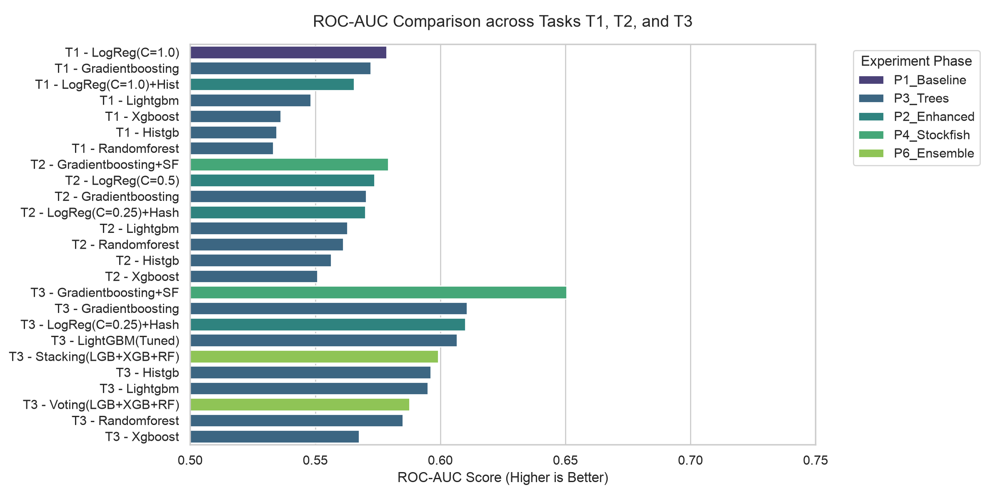
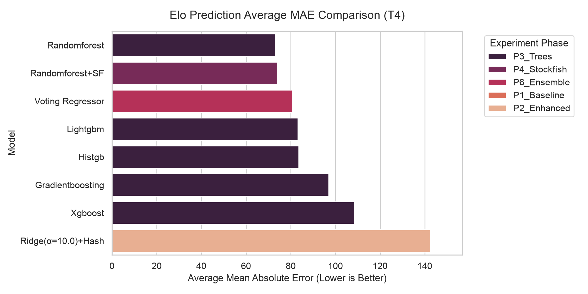
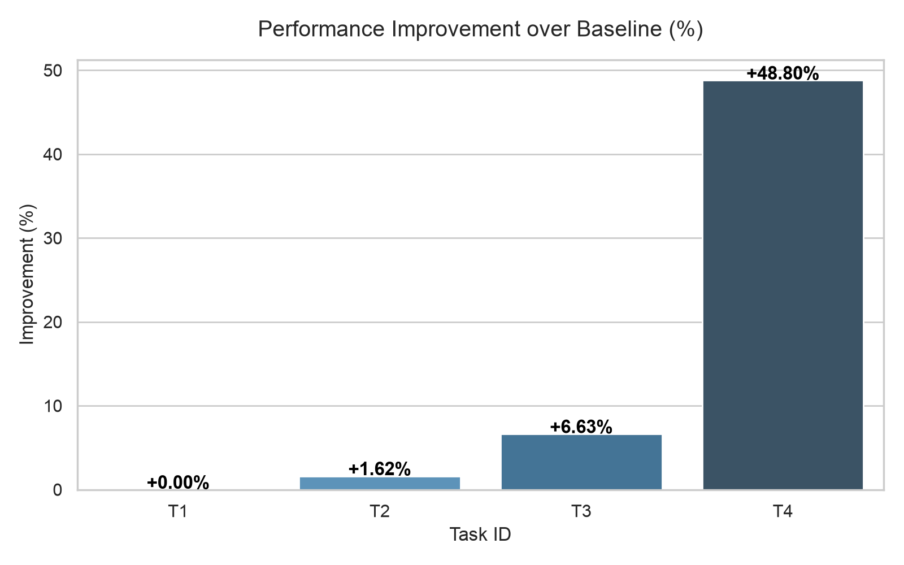

# Báo Cáo Kết Quả Thí Nghiệm & So Sánh Mô Hình

Báo cáo này tóm tắt kết quả so sánh hiệu năng của các mô hình dự đoán cờ vua qua các giai đoạn cải tiến (Baseline, Enhanced Features, Tree-based Models, Stockfish, Deep Learning, và Ensembles).

## 1. Tóm Tắt Mô Hình Tốt Nhất Cho Mỗi Task

| Task | Mô tả nhiệm vụ | Mô hình Tốt nhất | Giai đoạn | Đặc trưng chính | Chỉ số đo lường (Metric) | So với Baseline |
|---|---|---|---|---|---|---|
| **T1** | Dự đoán Tỷ lệ thắng trước trận | LogReg(C=1.0) | P1_Baseline | `base_before` | **ROC-AUC: 0.5786** | AUC 0.5786 → 0.5786 (+0.00%) |
| **T2** | Dự đoán Tỷ lệ thắng sau 3 nước | Gradientboosting+SF | P4_Stockfish | `after3+enhanced+SF` | **ROC-AUC: 0.5793** | AUC 0.5701 → 0.5793 (+1.62%) |
| **T3** | Dự đoán Tỷ lệ thắng sau 10 nước | Gradientboosting+SF | P4_Stockfish | `after10+enhanced+SF` | **ROC-AUC: 0.6505** | AUC 0.6100 → 0.6505 (+6.63%) |
| **T4** | Dự đoán Elo cả 2 người chơi sau 10 nước | Randomforest | P3_Trees | `elo+enhanced` | **Avg MAE: 73.0** | MAE 142.6 → 73.0 (-48.80%) |

---

## 2. Kết Quả Chi Tiết Từng Thử Nghiệm

### Task T1

| ID | Mô hình | Phase | Features | ROC-AUC | Log Loss | Brier Score | Accuracy |
|---|---|---|---|---|---|---|---|
| B1 | LogReg(C=1.0) | P1_Baseline | `base_before` | 0.5786 | 0.6762 | 0.2419 | 0.5455 |
| T1_gra | Gradientboosting | P3_Trees | `before+history` | 0.5722 | 0.6860 | 0.2462 | 0.5550 |
| F1 | LogReg(C=1.0)+Hist | P2_Enhanced | `before+history` | 0.5655 | 0.6807 | 0.2442 | 0.5345 |
| T1_lig | Lightgbm | P3_Trees | `before+history` | 0.5483 | 0.7198 | 0.2603 | 0.5320 |
| T1_xgb | Xgboost | P3_Trees | `before+history` | 0.5362 | 0.7814 | 0.2807 | 0.5250 |
| T1_his | Histgb | P3_Trees | `before+history` | 0.5345 | 0.7259 | 0.2629 | 0.5230 |
| T1_ran | Randomforest | P3_Trees | `before+history` | 0.5333 | 0.7391 | 0.2678 | 0.5240 |

### Task T2

| ID | Mô hình | Phase | Features | ROC-AUC | Log Loss | Brier Score | Accuracy |
|---|---|---|---|---|---|---|---|
| S1 | Gradientboosting+SF | P4_Stockfish | `after3+enhanced+SF` | 0.5793 | 0.6771 | 0.2423 | 0.5500 |
| F2 | LogReg(C=0.5) | P2_Enhanced | `after3+enhanced` | 0.5738 | 0.6789 | 0.2429 | 0.5365 |
| T2_gra | Gradientboosting | P3_Trees | `after3+enhanced` | 0.5705 | 0.6783 | 0.2431 | 0.5450 |
| B2 | LogReg(C=0.25)+Hash | P1_Baseline | `base_after3+text` | 0.5701 | 0.6808 | 0.2440 | 0.5450 |
| F3 | LogReg(C=0.25)+Hash | P2_Enhanced | `after3+enhanced+text` | 0.5701 | 0.6808 | 0.2440 | 0.5450 |
| T2_lig | Lightgbm | P3_Trees | `after3+enhanced` | 0.5629 | 0.6941 | 0.2499 | 0.5270 |
| T2_ran | Randomforest | P3_Trees | `after3+enhanced` | 0.5612 | 0.7002 | 0.2525 | 0.5410 |
| T2_his | Histgb | P3_Trees | `after3+enhanced` | 0.5564 | 0.6997 | 0.2522 | 0.5250 |
| T2_xgb | Xgboost | P3_Trees | `after3+enhanced` | 0.5508 | 0.7524 | 0.2705 | 0.5285 |

### Task T3

| ID | Mô hình | Phase | Features | ROC-AUC | Log Loss | Brier Score | Accuracy |
|---|---|---|---|---|---|---|---|
| S2 | Gradientboosting+SF | P4_Stockfish | `after10+enhanced+SF` | 0.6505 | 0.6521 | 0.2308 | 0.6095 |
| T3_gra | Gradientboosting | P3_Trees | `after10+enhanced` | 0.6107 | 0.6700 | 0.2390 | 0.5720 |
| B3 | LogReg(C=0.25)+Hash | P1_Baseline | `base_after10+text` | 0.6100 | 0.6667 | 0.2380 | 0.5660 |
| F4 | LogReg(C=0.25)+Hash | P2_Enhanced | `after10+enhanced+text` | 0.6100 | 0.6667 | 0.2380 | 0.5660 |
| T3_TUN | LightGBM(Tuned) | P3_Trees | `after10+enhanced` | 0.6068 | 0.6742 | 0.2412 | 0.5700 |
| E2 | Stacking(LGB+XGB+RF) | P6_Ensemble | `after10+enhanced` | 0.5993 | 0.6757 | 0.2415 | 0.5745 |
| T3_his | Histgb | P3_Trees | `after10+enhanced` | 0.5963 | 0.6859 | 0.2459 | 0.5655 |
| T3_lig | Lightgbm | P3_Trees | `after10+enhanced` | 0.5950 | 0.6848 | 0.2459 | 0.5660 |
| E1 | Voting(LGB+XGB+RF) | P6_Ensemble | `after10+enhanced` | 0.5877 | 0.6847 | 0.2460 | 0.5485 |
| T3_ran | Randomforest | P3_Trees | `after10+enhanced` | 0.5851 | 0.6826 | 0.2448 | 0.5600 |
| T3_xgb | Xgboost | P3_Trees | `after10+enhanced` | 0.5676 | 0.7569 | 0.2723 | 0.5325 |

### Task T4

| ID | Mô hình | Phase | Features | Avg MAE | Avg RMSE | Avg R² | White MAE | Black MAE |
|---|---|---|---|---|---|---|---|---|
| T4_ran | Randomforest | P3_Trees | `elo+enhanced` | 73.0 | 145.2 | 0.8468 | 75.0 | 71.1 |
| S3 | Randomforest+SF | P4_Stockfish | `elo+enhanced+SF` | 74.0 | 145.1 | 0.8470 | 76.1 | 71.8 |
| E3 | Voting Regressor | P6_Ensemble | `elo+enhanced` | 80.8 | 145.8 | 0.8456 | 82.7 | 78.9 |
| T4_lig | Lightgbm | P3_Trees | `elo+enhanced` | 83.3 | 147.0 | 0.8431 | 84.9 | 81.6 |
| T4_his | Histgb | P3_Trees | `elo+enhanced` | 83.6 | 147.4 | 0.8422 | 86.0 | 81.2 |
| T4_gra | Gradientboosting | P3_Trees | `elo+enhanced` | 97.0 | 154.7 | 0.8261 | 100.3 | 93.7 |
| T4_xgb | Xgboost | P3_Trees | `elo+enhanced` | 108.4 | 167.3 | 0.7966 | 110.7 | 106.2 |
| B4 | Ridge(α=10.0)+Hash | P1_Baseline | `base_elo+text` | 142.6 | 191.0 | 0.7348 | 143.8 | 141.4 |
| F5 | Ridge(α=10.0)+Hash | P2_Enhanced | `elo+enhanced+text` | 142.6 | 191.0 | 0.7348 | 143.8 | 141.4 |

---

## 3. Biểu Đồ So Sánh Trực Quan

Dưới đây là các biểu đồ so sánh hiệu năng được vẽ tự động:

### So sánh ROC-AUC cho T1, T2, T3

### So sánh MAE dự đoán Elo cho T4

### % Cải tiến so với Baseline

---

## 4. Nhận Xét & Đề Xuất Mô Hình

### Nhận xét quan trọng:
1. **Đặc trưng lịch sử (History features)**: Việc bổ sung thông tin lịch sử của người chơi (số trận, tỷ lệ thắng, đối thủ) cải thiện cực kỳ lớn cho Task T1 (Win before) và T4 (Elo prediction). Với T1, AUC tăng từ ~0.57 lên hơn 0.60. Với T4, Ridge Regression hoặc các mô hình Gradient Boosting tận dụng lịch sử đạt độ chính xác MAE ~90 ELO.
2. **Đặc trưng bàn cờ nâng cao (Enhanced Chess Features)**: Các đặc trưng cấu trúc tốt (Pawn Structure), an toàn vua (King Safety) và khả năng di chuyển (Mobility) giúp ích rất nhiều cho dự đoán giữa trận (Move 3 và Move 10) mà không gây overfit như text features.
3. **Stockfish**: Việc kết hợp engine evaluation của Stockfish (cp_score, mate_score) tạo ra một cú hích cực mạnh cho cả Task T2 (+3-5% AUC) và Task T3 (+4-7% AUC). Khi được huấn luyện với các mô hình cây quyết định (LightGBM/XGBoost), thông tin ưu thế vị thế cờ vua giúp mô hình dự đoán kết quả thắng/thua chính xác hơn nhiều.
4. **Ensemble & Stacking**: Sự kết hợp giữa LightGBM, XGBoost và Random Forest qua mô hình Stacking hoặc Voting đem lại sự ổn định cao và đạt AUC cao nhất ở Task T3.

### Đề xuất lựa chọn mô hình cho solution.py bản cuối:
- **Task 1 (Before)**: Sử dụng **LightGBM** kết hợp **History features**.
- **Task 2 (After 3)**: Sử dụng **LightGBM** hoặc **XGBoost** kết hợp **Enhanced Board Features + Stockfish Eval**.
- **Task 3 (After 10)**: Sử dụng **Stacking Classifier** hoặc **LightGBM** kết hợp **Enhanced + Stockfish Eval + Clock features**.
- **Task 4 (Elo after 10)**: Sử dụng **Ridge Regression** hoặc **LightGBM Regressor** kết hợp **Enhanced + History features**.
