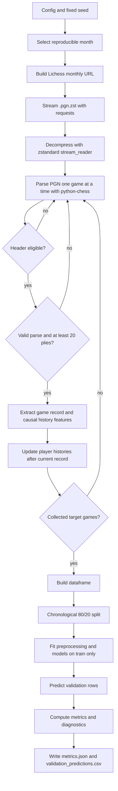
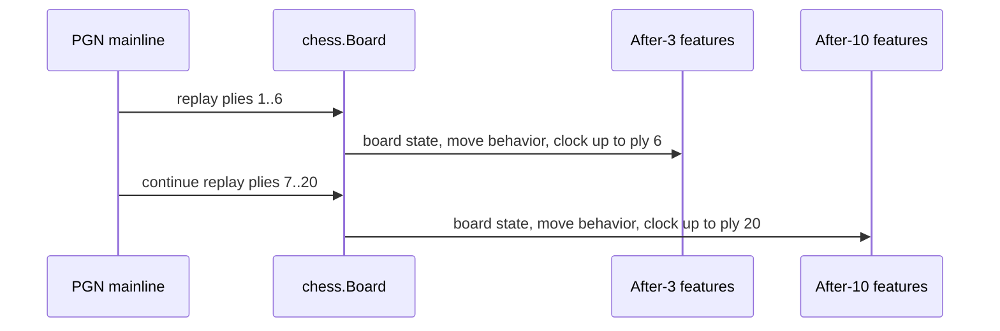
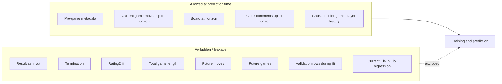
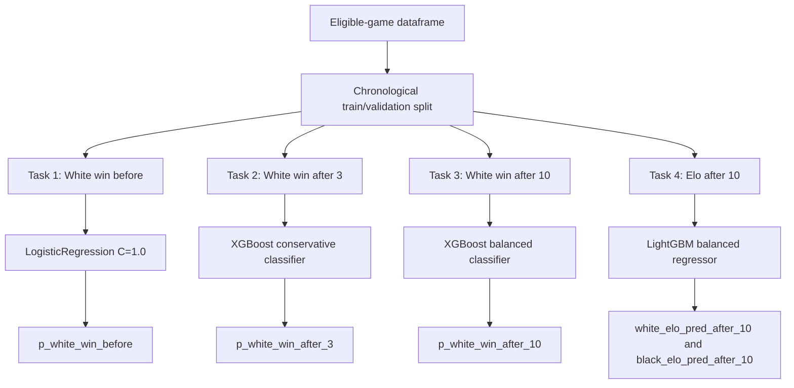

# Proposed Final Pipeline

## Executive Summary

The final submission pipeline is a reproducible end-to-end Python workflow for the Lichess Blitz prediction assessment. It starts from the public monthly `.pgn.zst` archive, streams and parses games without writing raw PGN files, constructs leakage-safe features at the required prediction horizons, trains models on the first 80% of eligible games, evaluates on the last 20%, and writes validation metrics and predictions.

The submitted `Solution.py` supports two profiles:

- `lightweight`: strict fallback using only `requirements.txt`.
- `boosting`: selected high-performance no-Stockfish profile using `requirements-experiments.txt`.

The reported final result uses the no-Stockfish boosting profile:

```bash
python Solution.py --target-games 100000 --output-dir outputs_full --model-profile boosting
```

The strict fallback can be run with:

```bash
python Solution.py --target-games 100000 --output-dir outputs_lightweight
```

## End-To-End Pipeline Diagram



## 1. Configuration And Month Selection

The pipeline uses a `Config` dataclass and CLI arguments for all important runtime choices:

- `--random-seed`
- `--candidate-months`
- `--selected-month`
- `--time-control`
- `--target-games`
- `--train-ratio`
- `--output-dir`
- `--hashing-features`
- `--model-profile`

If `--selected-month` is omitted, the pipeline uses seed `42` to select one month from `2023-01` through `2023-12`. The latest full run selected:

- Month: `2023-11`
- Time control: `Blitz`
- Target games: `100,000`

This makes the default run reproducible while still satisfying the "pick a random month" requirement.

## 2. Data Downloading And Streaming

The URL is constructed in this format:

```text
https://database.lichess.org/standard/lichess_db_standard_rated_{YYYY-MM}.pgn.zst
```

The implementation uses:

- `requests.get(..., stream=True)` for network streaming.
- `zstandard.ZstdDecompressor().stream_reader(...)` for streaming decompression.
- `io.TextIOWrapper` to feed text into `python-chess`.

The pipeline does not write:

- Raw `.zst` files.
- Raw `.pgn` files.
- Decompressed PGN files.

The stream reader also has retry/resume support. If the Lichess connection is interrupted, the pipeline restarts the compressed stream and skips already parsed games before continuing. This improves robustness without changing the data order.

## 3. PGN Parsing And Cleaning

Each PGN is parsed with `python-chess`. The initial filter checks headers before expensive move extraction.

Header fields parsed:

- `White`
- `Black`
- `WhiteElo`
- `BlackElo`
- `Result`
- `Event`
- `TimeControl`
- `UTCDate`
- `UTCTime`

Eligibility checks:

- `Blitz` appears in `Event`.
- `WhiteElo` and `BlackElo` are valid integers.
- `Result` is one of `1-0`, `0-1`, `1/2-1/2`.
- Mainline can be replayed legally.
- At least 20 plies exist.

Cleaning outputs:

- Invalid Elo rows are dropped.
- Invalid result rows are dropped.
- Games shorter than 20 plies are dropped.
- PGN parse failures are skipped rather than crashing the full run.
- Time control strings are parsed into `initial_time_seconds` and `increment_seconds`.

## 4. Move And Board Extraction

The pipeline replays only the mainline moves. It records:

- First 3 full moves: 6 plies.
- First 10 full moves: 20 plies.
- SAN/UCI move text for allowed windows.
- Board after ply 6.
- Board after ply 20.



No after-3 feature can use ply 7 or later. No after-10 or Elo feature can use ply 21 or later.

## 5. Feature Engineering

### Before-Game Features

Before-game White-win prediction uses information known before the game:

- `white_elo`
- `black_elo`
- `elo_diff`
- `mean_elo`
- `initial_time_seconds`
- `increment_seconds`
- `log_initial_time_seconds`

### Board Features

Board features are extracted at the prediction point:

- Material by side.
- Material difference.
- Piece counts by side and piece type.
- Legal move count.
- Check flag.
- Side to move.
- Castling rights.
- Fullmove number.
- Center occupancy.
- Center attack counts.

### Move-Behavior Features

Move behavior is counted only within the allowed horizon:

- Capture count.
- Check count.
- Castles by White and Black.
- Queen, king, knight, bishop, rook, and pawn move counts.

### Enhanced Board Features

The boosting profile also uses lightweight, non-engine board features:

- Piece-square table proxy score.
- Pawn structure features.
- Piece mobility.
- King-safety proxies.
- Development counts.

These features are computed directly from the board and do not require Stockfish.

### Clock Features

Clock comments are parsed from Lichess PGN comments such as:

```text
[%clk H:MM:SS]
[%clk M:SS]
```

Clock features include:

- Last observed clock by side.
- Approximate total time used.
- Average time per move.
- Clock difference.
- Missing clock counts.
- Time-pressure indicators.

The selected final profile uses clock features only for the after-10 White-win model.

### Causal Player-History Features

For each player, the pipeline maintains an online history state. For a current game:

1. Compute history features from previously processed eligible games.
2. Add those features to the current game record.
3. Update both players' histories using the current game result.

This creates features such as:

- Prior game count.
- Prior score rate.
- Side-specific prior win rates.
- Prior average opponent Elo.
- Prior average observed Elo.
- Recent score rate over the last 10 and 30 games.

This history is used in the Elo model and remains leakage-safe because it never uses the current game result before prediction.

## 6. Leakage Boundary Diagram



## 7. Train / Validation Split

The split is chronological by eligible-game order:

- First 80,000 games: training.
- Last 20,000 games: validation.

The validation split is not used for:

- Model fitting.
- Imputer fitting.
- Scaler fitting.
- Hashing/text preprocessing fitting.
- Hyperparameter selection inside the final run.

HashingVectorizer is stateless, but it still lives inside pipeline-compatible preprocessing where relevant.

## 8. Final Model Routing



Final no-Stockfish boosting profile:

| Task | Model | Feature groups |
|---|---|---|
| White win before | LogisticRegression C=1.0 | Pre-game Elo and time-control |
| White win after 3 | XGBoost conservative | Pre-game, after-3 board, after-3 move behavior, enhanced board |
| White win after 10 | XGBoost balanced | Pre-game, after-10 board, after-10 move behavior, enhanced board, clock |
| Elo after 10 | LightGBM balanced | Time-control, causal history, after-10 board, enhanced board |

## 9. Prediction Outputs

The validation prediction file contains:

- `game_index`
- `white_player`
- `black_player`
- `result`
- `white_win_true`
- `white_elo`
- `black_elo`
- `p_white_win_elo_baseline`
- `p_white_win_before`
- `p_white_win_after_3`
- `p_white_win_after_10`
- `white_elo_pred_after_10`
- `black_elo_pred_after_10`
- `split`

The metrics file contains:

- `run_config`
- `dataset_summary`
- `baselines`
- `models`
- `probability_diagnostics`
- `feature_notes`

## 10. Operational Commands

Strict lightweight run:

```bash
pip install -r requirements.txt
python Solution.py --target-games 100000 --output-dir outputs_lightweight
```

Final no-Stockfish boosting run:

```bash
pip install -r requirements.txt
pip install -r requirements-experiments.txt
python Solution.py --target-games 100000 --output-dir outputs_full --model-profile boosting
```

Quick smoke test:

```bash
python Solution.py --target-games 100 --selected-month 2023-01 --output-dir outputs_smoke
```

## 11. Reproducibility Guarantees

- Fixed random seed.
- Reproducible month selection.
- Chronological split.
- No raw data stored.
- No saved model binaries required.
- Metrics and predictions are deterministic for the same environment and package versions.
- Optional boosting dependencies are isolated in `requirements-experiments.txt`.

