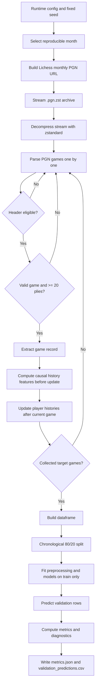
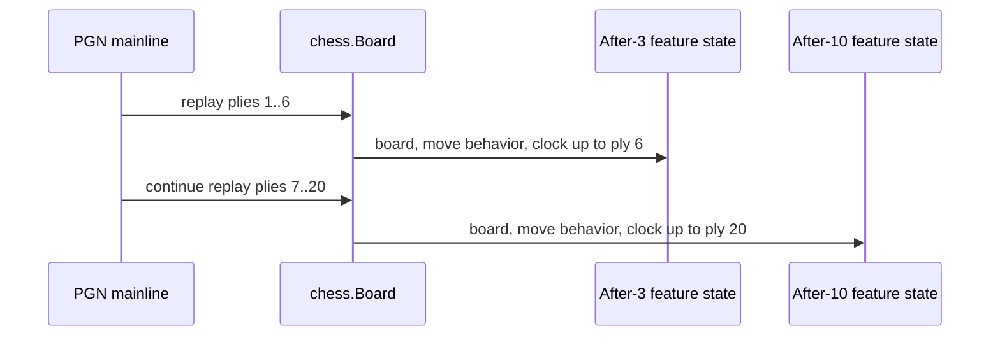
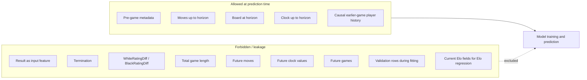
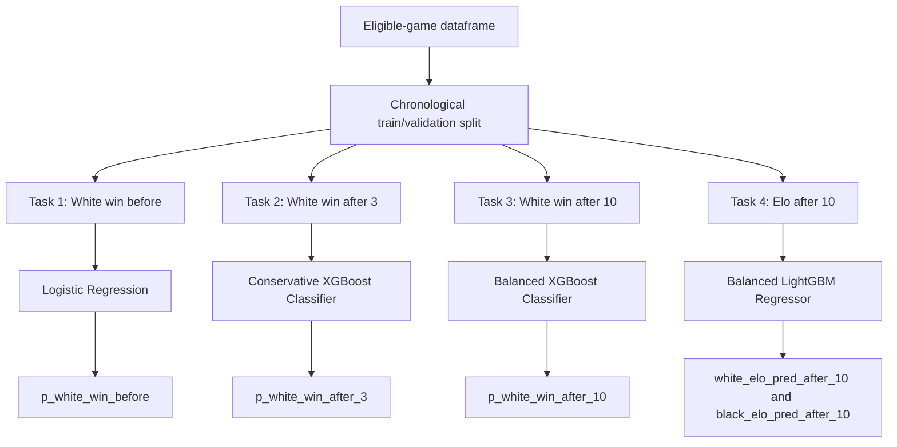

# Proposed Final Pipeline

## 1. Executive Summary

The final submission pipeline is a reproducible end-to-end Python workflow for the Lichess Blitz prediction assessment.

The pipeline starts from the public Lichess monthly `.pgn.zst` archive, streams and decompresses the data without storing raw PGN files, parses games one by one, filters the first 100,000 eligible Blitz games, constructs leakage-safe features at the required prediction horizons, trains models on the first 80% of eligible games, validates on the last 20%, and writes metrics and prediction outputs.

The solution supports two execution profiles:

| Profile       | Purpose                                 | Dependency level                                    | Stockfish required |
| ------------- | --------------------------------------- | --------------------------------------------------- | ------------------ |
| `lightweight` | Strict fallback profile                 | `requirements.txt` only                             | No                 |
| `boosting`    | Final selected high-performance profile | `requirements.txt` + `requirements-experiments.txt` | No                 |

The final reported run uses the **no-Stockfish boosting profile**:

```bash
python solution.py --target-games 100000 --output-dir outputs_full --model-profile boosting
```

The strict fallback can be run with:

```bash
python solution.py --target-games 100000 --output-dir outputs_lightweight --model-profile lightweight
```

The final selected profile is:

| Task                                      | Selected model       | Feature profile                                        |
| ----------------------------------------- | -------------------- | ------------------------------------------------------ |
| White-win probability before game         | Logistic Regression  | Pre-game Elo and time-control features                 |
| White-win probability after 3 full moves  | Conservative XGBoost | After-3 enhanced board features, no Stockfish          |
| White-win probability after 10 full moves | Balanced XGBoost     | After-10 enhanced board + clock features, no Stockfish |
| Elo prediction after 10 full moves        | Balanced LightGBM    | Elo-safe enhanced features + causal player history     |

This design gives strong validation performance while keeping the default final pipeline portable and independent of external chess engines.

---

## 2. End-to-End Pipeline Overview



The pipeline is intentionally linear and auditable. Each game is processed in chronological file order. Player-history features are computed before updating the current game, preventing future-game leakage.

---

## 3. Runtime Configuration

The pipeline exposes important runtime choices through CLI arguments.

Main arguments:

| Argument             | Purpose                                        |
| -------------------- | ---------------------------------------------- |
| `--random-seed`      | Controls reproducible random month selection   |
| `--candidate-months` | Candidate months for random selection          |
| `--selected-month`   | Optional explicit `YYYY-MM` month override     |
| `--time-control`     | Selected time-control, default `Blitz`         |
| `--target-games`     | Number of eligible games to collect            |
| `--train-ratio`      | Chronological train ratio, default `0.80`      |
| `--output-dir`       | Directory for metrics and predictions          |
| `--hashing-features` | Number of hashing dimensions for text features |
| `--model-profile`    | `lightweight` or `boosting`                    |

Default values:

| Setting                  |                  Value |
| ------------------------ | ---------------------: |
| Random seed              |                   `42` |
| Candidate months         | `2023-01` to `2023-12` |
| Time-control             |                `Blitz` |
| Target games             |              `100,000` |
| Train ratio              |                 `0.80` |
| Hashing dimensions       |                 `2^15` |
| Default output directory |              `outputs` |

If `--selected-month` is omitted, the pipeline selects one month reproducibly using seed `42`. The final reported full run used:

| Setting            | Value             |
| ------------------ | ----------------- |
| Selected month     | `2023-11`         |
| Time-control       | `Blitz`           |
| Eligible games     | `100,000`         |
| Train / validation | `80,000 / 20,000` |

---

## 4. Data Downloading and Streaming

The pipeline constructs the Lichess archive URL using:

```text
https://database.lichess.org/standard/lichess_db_standard_rated_{YYYY-MM}.pgn.zst
```

For example, for `2023-11`:

```text
https://database.lichess.org/standard/lichess_db_standard_rated_2023-11.pgn.zst
```

The implementation streams the compressed file directly from the network:

* `requests.get(..., stream=True)` streams the remote archive.
* `zstandard.ZstdDecompressor().stream_reader(...)` decompresses the `.zst` stream.
* `io.TextIOWrapper(...)` converts decompressed bytes into text.
* `python-chess` reads PGN games one by one.

The pipeline does **not** write raw data files to disk:

* no raw `.zst`,
* no raw `.pgn.zst`,
* no decompressed `.pgn`.

This keeps the submission lightweight and avoids accidentally including large raw data files.

The stream reader also includes retry/resume behavior. If the network stream is interrupted, the pipeline can reconnect and skip already parsed games before continuing. This improves robustness without changing chronological game order.

---

## 5. PGN Parsing and Eligibility Filtering

Each PGN game is parsed with `python-chess`.

The pipeline first applies cheap header-level filters before expensive move replay.

Important PGN headers:

| Header               | Use                                       |
| -------------------- | ----------------------------------------- |
| `White`              | White player identity                     |
| `Black`              | Black player identity                     |
| `WhiteElo`           | White Elo target / classification feature |
| `BlackElo`           | Black Elo target / classification feature |
| `Result`             | Target label                              |
| `Event`              | Time-control filtering                    |
| `TimeControl`        | Initial time and increment parsing        |
| `UTCDate`, `UTCTime` | Chronological metadata                    |

A game is eligible if:

* it comes from the selected monthly standard rated archive,
* it belongs to the selected time-control category, `Blitz`,
* `WhiteElo` and `BlackElo` are valid integers,
* `Result` is one of `1-0`, `0-1`, or `1/2-1/2`,
* the PGN can be parsed successfully,
* the mainline moves can be legally replayed,
* the game has at least 20 plies, equivalent to 10 full moves.

The 20-ply requirement ensures that all four tasks use the same game universe.

Invalid rows are skipped rather than crashing the run. This includes invalid Elo values, invalid results, corrupted PGNs, illegal move sequences, or games shorter than 10 full moves.

---

## 6. Target Definitions

The pipeline produces four targets.

### 6.1 White-Win Binary Target

White-win probability is modeled as binary classification:

```text
white_win = 1 if Result == "1-0"
white_win = 0 if Result == "0-1" or Result == "1/2-1/2"
```

Draws are treated as non-White-wins. This makes the task a binary White-win prediction problem.

### 6.2 Elo Regression Targets

For Elo prediction, the targets are:

```text
WhiteElo
BlackElo
```

These values are prediction targets only. For the Elo regression model, current-game Elo-derived fields are excluded from input features:

* `WhiteElo`,
* `BlackElo`,
* `elo_diff`,
* `mean_elo`.

The intended task is:

> Given the first 10 full moves and valid causal historical information, estimate both players' Elo ratings without directly using their current-game Elo headers as features.

---

## 7. Move and Board Extraction

The pipeline replays only the mainline moves.

Prediction horizons:

| Task                          |       Horizon | Ply count |
| ----------------------------- | ------------: | --------: |
| After-3 White-win prediction  |  3 full moves |   6 plies |
| After-10 White-win prediction | 10 full moves |  20 plies |
| Elo after-10 prediction       | 10 full moves |  20 plies |

During replay, the pipeline records:

* SAN move tokens,
* UCI move tokens,
* board state after ply 6,
* board state after ply 20,
* move-behavior counters up to ply 6,
* move-behavior counters up to ply 20,
* clock comments up to each horizon.



Feature boundaries:

* After-3 features cannot use ply 7 or later.
* After-10 features cannot use ply 21 or later.
* Elo after-10 features cannot use ply 21 or later.
* No task can use final game length as a feature.

---

## 8. Feature Engineering

The final pipeline uses several feature groups.

### 8.1 Pre-Game Features

Pre-game features are known before move 1:

* `white_elo`,
* `black_elo`,
* `elo_diff`,
* `mean_elo`,
* `initial_time_seconds`,
* `increment_seconds`,
* `log_initial_time_seconds`.

These features are valid for White-win classification. For Elo regression, current-game Elo and Elo-derived features are excluded.

---

### 8.2 Move Text Features

Move text features encode early move choices.

The pipeline records SAN and UCI-style tokens from the allowed horizon:

* first 6 plies for after-3,
* first 20 plies for after-10.

Text is encoded with `HashingVectorizer`, which avoids storing a learned vocabulary file.

This keeps the pipeline compact and reduces the risk of vocabulary-fitting leakage.

---

### 8.3 Basic Board Features

Basic board features are extracted from the board at the prediction horizon.

Examples:

* material by side,
* material difference,
* piece counts by side and piece type,
* legal move count,
* check flag,
* side to move,
* castling rights,
* fullmove number,
* center occupancy,
* center attack counts.

These features are lightweight and do not require a chess engine.

---

### 8.4 Move-Behavior Features

Move-behavior features count what happened within the legal horizon:

* capture count,
* check count,
* White castle count,
* Black castle count,
* queen move count,
* king move count,
* knight move count,
* bishop move count,
* rook move count,
* pawn move count.

For after-3, these are counted only up to ply 6.
For after-10 and Elo, these are counted only up to ply 20.

---

### 8.5 Enhanced Board Features

The boosting profile uses additional lightweight positional features.

Examples:

* piece-square table proxy score,
* pawn structure features,
* mobility features,
* king-safety proxies,
* development counts,
* attack coverage,
* positional score difference.

These are computed directly from the board. They do not require Stockfish.

The purpose of enhanced board features is to give boosting models richer numeric inputs than simple material and piece counts.

---

### 8.6 Clock Features

Lichess PGN comments may contain clock annotations such as:

```text
[%clk H:MM:SS]
[%clk M:SS]
```

The pipeline parses these comments into remaining seconds.

Clock features include:

* last observed White clock,
* last observed Black clock,
* total approximate time used by White,
* total approximate time used by Black,
* average time per move,
* clock difference,
* time-used difference,
* minimum observed clock,
* missing clock counts,
* time-pressure flags,
* time-used ratios.

The final selected profile uses clock features for the after-10 White-win model because experiments showed clock information is more useful after 10 full moves than after 3 full moves.

---

### 8.7 Causal Player-History Features

For each player, the pipeline maintains an online history state.

For a current game:

1. Compute history features from previously processed eligible games only.
2. Add those features to the current game record.
3. Update both players' histories using the current game result and Elo.

This avoids future-game leakage.

History features include:

* prior game count,
* prior score rate,
* side-specific prior win rates,
* prior average opponent Elo,
* prior average observed player Elo,
* recent score rate over the last 10 games,
* recent score rate over the last 30 games,
* differences between White and Black historical features.

Causal history is especially important for Elo prediction because repeat-player patterns and prior observed strength contain strong information about later games in the same chronological stream.

---

## 9. Leakage Control

The pipeline explicitly separates allowed and forbidden information.



Forbidden features:

* `Result`,
* `Termination`,
* `WhiteRatingDiff`,
* `BlackRatingDiff`,
* total game length,
* moves after the task horizon,
* clock values after the task horizon,
* future games,
* validation rows during fitting,
* current-game Elo fields for Elo regression.

For Elo regression, the following are additionally blocked:

* `white_elo`,
* `black_elo`,
* `elo_diff`,
* `mean_elo`.

If any forbidden Elo feature appears in the Elo feature list, the code raises an error.

---

## 10. Train / Validation Split

The split is chronological by eligible-game order:

| Split      |                 Rows |
| ---------- | -------------------: |
| Train      | first `80,000` games |
| Validation |  last `20,000` games |

The validation set is not used for:

* model fitting,
* imputer fitting,
* scaler fitting,
* hyperparameter fitting inside the final run,
* vocabulary fitting.

`HashingVectorizer` is stateless, but it is still used inside pipeline-compatible preprocessing where relevant.

This design mimics a forward-looking evaluation setup: train on earlier games and evaluate on later games.

---

## 11. Model Profiles

The solution supports two model profiles.

## 11.1 Lightweight Profile

The lightweight profile is the strict fallback. It is designed to run with only the core dependencies in `requirements.txt`.

Typical models:

| Task               | Model               |
| ------------------ | ------------------- |
| White win before   | Logistic Regression |
| White win after 3  | Logistic Regression |
| White win after 10 | Logistic Regression |
| Elo after 10       | Ridge Regression    |

This profile is useful for quick checks and maximum portability.

---

## 11.2 Boosting Profile

The boosting profile is the final selected high-performance profile. It uses optional tabular boosting dependencies but does not use Stockfish.

Final model routing:



Final boosting profile:

| Task               | Selected model       | Feature groups                                             |
| ------------------ | -------------------- | ---------------------------------------------------------- |
| White win before   | Logistic Regression  | Pre-game Elo and time-control                              |
| White win after 3  | Conservative XGBoost | Pre-game + after-3 enhanced board features                 |
| White win after 10 | Balanced XGBoost     | Pre-game + after-10 enhanced board + clock features        |
| Elo after 10       | Balanced LightGBM    | Time-control + causal history + after-10 enhanced features |

No Stockfish features are required in this selected final profile.

---

## 12. Why This Pipeline Was Selected

The final pipeline was selected based on experiment results and practical submission constraints.

### 12.1 T1: Logistic Regression for Before-Game Prediction

Before-game White-win prediction is mostly driven by Elo difference. Tree-based models did not improve generalization for this task.

Therefore, Logistic Regression was selected because it is:

* stable,
* simple,
* well-calibrated enough for this task,
* easy to explain,
* and competitive with more complex models.

### 12.2 T2: Conservative XGBoost for After-3 Prediction

After 3 full moves, the game is still early and the signal is limited. Enhanced board features improve the model modestly.

Conservative XGBoost was selected because it improves over the earlier lightweight production model while avoiding Stockfish dependency.

### 12.3 T3: Balanced XGBoost for After-10 Prediction

After 10 full moves, the board and clock state contain meaningful predictive information.

Balanced XGBoost was selected because it gave the best no-Stockfish after-10 performance. It improves both ROC-AUC and probability quality compared with the Elo expected-score baseline and earlier logistic models.

### 12.4 T4: Balanced LightGBM for Elo Prediction

Elo prediction benefits heavily from causal player history and nonlinear interactions.

Balanced LightGBM was selected because it gives strong Elo MAE while remaining no-Stockfish.

The main caveat is that Elo prediction is repeat-player-sensitive. The model is leakage-safe under the chronological setup, but its strongest performance comes from causal same-month history and player-overlap patterns.

---

## 13. Why Stockfish Is Not Required

Stockfish was tested as an exploratory enhancement. It provides strong chess-engine evaluation features, especially after 10 moves.

However, Stockfish is not required in the final selected pipeline because:

* it needs an external engine binary or precomputed cache,
* it makes reproduction more fragile,
* it increases setup burden for the evaluator,
* it is not necessary for the final no-Stockfish boosting profile,
* and it barely improves Elo prediction compared with causal history.

The final pipeline therefore keeps Stockfish as a research reference, not as a default dependency.

---

## 14. Why Ensemble and Stacking Were Not Selected

Voting and stacking models were tested, but they were not selected.

Reasons:

* They did not beat the best single after-10 no-Stockfish model.
* The Elo improvement from voting was not large enough to justify the added complexity.
* Stacking requires careful out-of-fold training to avoid leakage.
* Ensembles increase runtime and reduce interpretability.
* The final single-model routing is easier to reproduce and defend.

The selected pipeline uses strong single-task models instead of an ensemble.

---

## 15. Final Verified Run

The final production-style run used:

```bash
python solution.py --target-games 100000 --output-dir outputs_solution_improvements_100k_final --model-profile boosting
```

Dataset summary:

| Item                     |      Value |
| ------------------------ | ---------: |
| Runtime                  |  `645.82s` |
| Month                    |  `2023-11` |
| Time-control             |    `Blitz` |
| Parsed games             |  `213,463` |
| Header-eligible games    |  `104,005` |
| Final eligible games     |  `100,000` |
| Train rows               |   `80,000` |
| Validation rows          |   `20,000` |
| Train positive rate      | `0.493950` |
| Validation positive rate | `0.496400` |

Classification metrics:

| Task                  |    ROC-AUC |   Log loss |      Brier |   Accuracy |
| --------------------- | ---------: | ---------: | ---------: | ---------: |
| Before-game           | `0.578805` | `0.678818` | `0.243280` | `0.552550` |
| After-3               | `0.578667` | `0.679298` | `0.243440` | `0.550400` |
| After-10              | `0.622593` | `0.663965` | `0.236364` | `0.579900` |
| Elo expected baseline | `0.578497` | `0.680803` | `0.243974` |        n/a |
| Majority baseline     |        n/a |        n/a |        n/a | `0.503600` |

Elo regression metrics:

| Model         | White MAE | Black MAE |          White R² |          Black R² |
| ------------- | --------: | --------: | ----------------: | ----------------: |
| Elo after-10  |  `29.241` |  `29.376` |        `0.950259` |        `0.949865` |
| Mean baseline | `300.224` | `300.586` | approximately `0` | approximately `0` |

Key improvements:

```text
After-10 ROC-AUC improvement over Elo baseline:
0.622593 - 0.578497 = 0.044096
```

```text
After-10 log-loss improvement over Elo baseline:
0.680803 - 0.663965 = 0.016838
```

```text
After-10 Brier improvement over Elo baseline:
0.243974 - 0.236364 = 0.007610
```

```text
Elo MAE improvement over mean baseline:
White: 300.224 -> 29.241
Black: 300.586 -> 29.376
```

These results support the selected no-Stockfish boosting profile.

---

## 16. Prediction Outputs

The validation prediction file contains:

* `game_index`,
* `white_player`,
* `black_player`,
* `result`,
* `white_win_true`,
* `white_elo`,
* `black_elo`,
* `p_white_win_elo_baseline`,
* `p_white_win_before`,
* `p_white_win_after_3`,
* `p_white_win_after_10`,
* `white_elo_pred_after_10`,
* `black_elo_pred_after_10`,
* `split`.

The metrics file contains:

* `run_config`,
* `dataset_summary`,
* `baselines`,
* `models`,
* `probability_diagnostics`,
* `feature_notes`.

Core output files:

```text
metrics.json
validation_predictions.csv
```

---

## 17. Operational Commands

Install strict requirements:

```bash
pip install -r requirements.txt
```

Run strict lightweight profile:

```bash
python solution.py --target-games 100000 --output-dir outputs_lightweight --model-profile lightweight
```

Install optional boosting requirements:

```bash
pip install -r requirements.txt
pip install -r requirements-experiments.txt
```

Run final selected no-Stockfish boosting profile:

```bash
python solution.py --target-games 100000 --output-dir outputs_full --model-profile boosting
```

Run a smoke test:

```bash
python solution.py --target-games 100 --selected-month 2023-01 --output-dir outputs_smoke --model-profile lightweight
```

Run a small boosting smoke test:

```bash
python solution.py --target-games 1000 --selected-month 2023-01 --output-dir outputs_boosting_smoke --model-profile boosting
```

---

## 18. Reproducibility Guarantees

The pipeline is designed to be reproducible:

* fixed random seed,
* reproducible month selection,
* deterministic chronological split,
* no raw PGN or compressed data stored,
* no saved model binaries required,
* no Stockfish dependency in the final selected profile,
* validation rows are not used for fitting,
* metrics and predictions are written as plain files,
* optional boosting dependencies are separated from the strict fallback profile.

For the same environment and package versions, the same command should produce the same selected month, the same eligible game order, and the same metrics.

---

## 19. Limitations and Caveats

The final pipeline is leakage-safe under the implemented chronological validation protocol, but several limitations should be noted.

### White-Win Prediction

White-win prediction is inherently noisy. Even with Elo, board state, clock features, and move behavior, chess outcomes contain substantial uncertainty. Therefore, ROC-AUC and probability quality are more meaningful than raw accuracy.

### Draw Handling

Draws are treated as non-White-wins. This makes the task binary, but it differs from Elo expected score, where draws are worth half a point.

### Elo Prediction

The Elo model uses causal history and player-overlap signals. This is valid because the history is computed only from previous games, but the headline MAE is most reliable when the validation/test stream has a similar repeat-player structure.

### External Engine Features

Stockfish was intentionally excluded from the final default profile. This improves portability but gives up the highest possible after-10 AUC observed in exploratory experiments.

---

## 20. Final Pipeline Recommendation

The recommended final submission command is:

```bash
python solution.py --target-games 100000 --output-dir outputs_full --model-profile boosting
```

This profile is selected because it:

* keeps the full pipeline reproducible,
* avoids requiring Stockfish,
* improves after-3 and after-10 prediction over the earlier lightweight profile,
* improves Elo regression substantially over the Ridge and mean baselines,
* preserves strict leakage boundaries,
* and remains compact enough for a coding assessment submission.

The strict lightweight profile should remain available as a fallback, but the no-Stockfish boosting profile is the final recommended pipeline.
